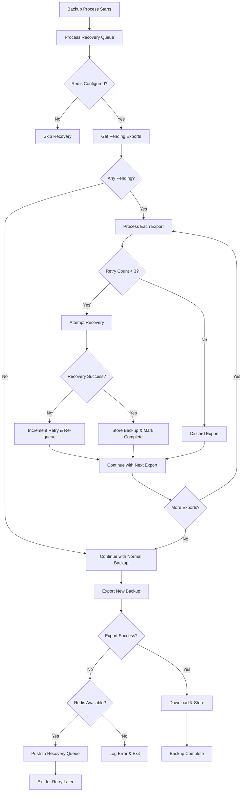

```mermaid
graph TD
    A["Backup Process Starts"] --> B["Process Recovery Queue"]
    B --> C{"Redis Configured?"}
    C -->|No| D["Skip Recovery"]
    C -->|Yes| E["Get Pending Exports"]
    E --> F{"Any Pending?"}
    F -->|No| G["Continue with Normal Backup"]
    F -->|Yes| H["Process Each Export"]
    H --> I{"Retry Count < 3?"}
    I -->|No| J["Discard Export"]
    I -->|Yes| K["Attempt Recovery"]
    K --> L{"Recovery Success?"}
    L -->|Yes| M["Store Backup & Mark Complete"]
    L -->|No| N["Increment Retry & Re-queue"]
    N --> O["Continue with Next Export"]
    M --> O
    J --> O
    O --> P{"More Exports?"}
    P -->|Yes| H
    P -->|No| G
    G --> Q["Export New Backup"]
    Q --> R{"Export Success?"}
    R -->|Yes| S["Download & Store"]
    R -->|No| T{"Redis Available?"}
    T -->|Yes| U["Push to Recovery Queue"]
    T -->|No| V["Log Error & Exit"]
    S --> W["Backup Complete"]
    U --> X["Exit for Retry Later"]

```
